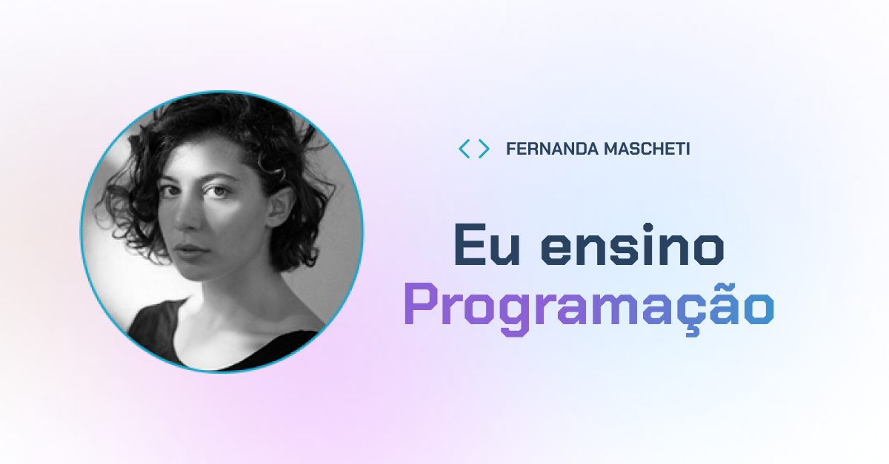
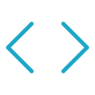

# 📘 TESTE TÉCNICO ALURA

Este projeto foi desenvolvido utilizando **Next.js 15** com foco em performance, responsividade, acessibilidade e boas práticas de SEO.  
O layout foi implementado de acordo com o design fornecido no Figma, garantindo fidelidade visual e uma ótima experiência de usuário.

---

## 🚀 Tecnologias Utilizadas

- [Next.js 15](https://nextjs.org/) (App Router)
- [TypeScript](https://www.typescriptlang.org/) (tipagem segura)
- [Tailwind CSS 4](https://tailwindcss.com/) (estilização)

---

## 🔍 SEO e Otimizações

### 📊 Imagem SEO para Redes Sociais

O site possui uma imagem otimizada para compartilhamento em redes sociais:



**Especificações:**

- Tamanho: 1200x630px (padrão recomendado)
- Formato: PNG
- Usado em: Open Graph e Twitter Cards

### 🔗 Sitemap Dinâmico

O sitemap é gerado automaticamente e inclui todas as páginas e posts do blog:

**Acesso:** `https://teste-tecnico-alura-two.vercel.app/sitemap.xml`

**Estrutura:**

```xml
- Página inicial (priority: 1.0)
- Página do blog (priority: 0.8)
- Posts individuais (priority: 0.6)
```

### 🤖 Robots.txt

Arquivo de diretrizes para bots de busca:

**Acesso:** `https://teste-tecnico-alura-two.vercel.app/robots.txt`

```
User-agent: *
Allow: /
Sitemap: https://teste-tecnico-alura-two.vercel.app/sitemap.xml
```

### 🎯 Favicons Completos

O site possui um conjunto completo de favicons para diferentes dispositivos e plataformas:

#### Favicon Principal


#### Variações por Tamanho

| Tamanho                                       | Tipo      | Uso                                  |
| --------------------------------------------- | --------- | ------------------------------------ |
|             | 16x16px   | Aba do navegador                     |
|             | 32x32px   | Aba do navegador (alta resolução)    |
|        | 180x180px | iOS Safari, adicionar à tela inicial |
|  | 192x192px | Android Chrome                       |
|  | 512x512px | Android Chrome (alta resolução)      |

### 🏷️ Meta Tags Implementadas

```html
<!-- Meta tags básicas -->
<meta
  name="description"
  content="Portfolio da desenvolvedora front-end Fernanda Mascheti"
/>
<meta
  name="keywords"
  content="desenvolvedora, frontend, react, nextjs, javascript, typescript"
/>
<meta name="author" content="Fernanda Mascheti" />

<!-- Open Graph (Facebook, LinkedIn) -->
<meta
  property="og:title"
  content="Fernanda Mascheti - Desenvolvedora Front-end"
/>
<meta
  property="og:description"
  content="Portfolio da desenvolvedora front-end Fernanda Mascheti"
/>
<meta property="og:image" content="/seo.png" />
<meta property="og:type" content="website" />

<!-- Twitter Cards -->
<meta name="twitter:card" content="summary_large_image" />
<meta
  name="twitter:title"
  content="Fernanda Mascheti - Desenvolvedora Front-end"
/>
<meta
  name="twitter:description"
  content="Portfolio da desenvolvedora front-end Fernanda Mascheti"
/>
<meta name="twitter:image" content="/seo.png" />

<!-- PWA -->
<link rel="manifest" href="/site.webmanifest" />
<meta name="theme-color" content="#2563eb" />
```

### 📱 Web App Manifest

Configuração para Progressive Web App (PWA):

```json
{
  "name": "Fernanda Mascheti - Desenvolvedora Front-end",
  "short_name": "Fernanda Mascheti",
  "description": "Portfolio da desenvolvedora front-end Fernanda Mascheti",
  "theme_color": "#2563eb",
  "background_color": "#ffffff",
  "display": "standalone",
  "start_url": "/"
}
```

---

## ♿ Acessibilidade (WCAG 2.1 AA)

O projeto foi desenvolvido seguindo as diretrizes de acessibilidade WCAG 2.1 nível AA:

### 🎯 Recursos Implementados

- ✅ **Skip Links**: Navegação rápida para o conteúdo principal
- ✅ **Navegação por Teclado**: Todos os elementos interativos são acessíveis via Tab
- ✅ **Focus Visível**: Estados de foco claramente visíveis
- ✅ **Textos Alternativos**: Todas as imagens possuem `alt` descritivos
- ✅ **Labels Semânticos**: Formulários com labels apropriados
- ✅ **ARIA Attributes**: Uso correto de `aria-label` e `role`
- ✅ **Estrutura Semântica**: HTML semântico com `header`, `main`, `section`, `nav`
- ✅ **Contraste de Cores**: Atende aos padrões WCAG AA

---

## 🛠️ Como Executar o Projeto

### Pré-requisitos

- Node.js 18+
- npm ou yarn

### Instalação

```bash
# Clone o repositório
git clone https://github.com/ArthurMaciel95/teste-tecnico-alura.git

# Entre no diretório
cd teste-tecnico-alura

# Instale as dependências
npm install

# Execute em modo de desenvolvimento
npm run dev
```

### Scripts Disponíveis

```bash
npm run dev      # Executa em modo desenvolvimento
npm run build    # Gera build de produção
npm run start    # Executa build de produção
npm run lint     # Executa linting do código
```

---

## 🌐 API Integration

O projeto consome a API externa para carregar os posts:

**Base URL:** `https://teste-tecnico-alura-two.vercel.app`

### Endpoints Utilizados:

- `GET /api/posts` - Lista todos os posts com paginação
- `GET /api/posts/category/[category]` - Posts por categoria
- `GET /api/posts/tags/[tag]` - Posts por tag
- `GET /api/posts/id/[id]` - Post específico por ID

---

## 📊 Performance

### Otimizações Implementadas:

- ✅ **Server-Side Rendering (SSR)** para melhor SEO
- ✅ **Static Generation** quando possível
- ✅ **Image Optimization** com Next.js Image
- ✅ **Font Optimization** com next/font
- ✅ **Cache Strategy** com revalidação inteligente
- ✅ **Bundle Splitting** automático do Next.js

---

## 🎨 Design System

### Cores Principais:

- **Brand Blue 600**: `#2563eb` (CTA principal)
- **Brand Blue 500**: `#3b82f6` (Links e elementos interativos)
- **Brand Blue 300**: `#6e859f` (Texto secundário)
- **Brand Purple**: Gradiente para elementos destacados

### Tipografia:

- **Chakra Petch**: Títulos e elementos de destaque
- **Inter**: Texto corpo e elementos gerais

---

## ✅ Requisitos Atendidos

- [x] Utilizar Next.js 15 com App Router
- [x] Utilizar TypeScript com tipagem segura
- [x] Utilizar Tailwind 4 para estilização
- [x] Consumir a API fake para carregar as postagens
- [x] Implementar boas práticas de SEO
- [x] Implementar boas práticas de acessibilidade
- [x] Seguir fielmente o design fornecido no Figma
- [x] Entregar um layout 100% responsivo
- [x] Garantir ótima performance e carregamento rápido

---

### Variáveis de Ambiente:

```env
NEXT_PUBLIC_API_BASE_URL=https://teste-tecnico-alura-two.vercel.app
```

---

## 📄 Licença

Este projeto foi desenvolvido como teste técnico para a Alura.

---

**Desenvolvido com ❤️ por [Arthur Maciel](https://github.com/ArthurMaciel95)**
